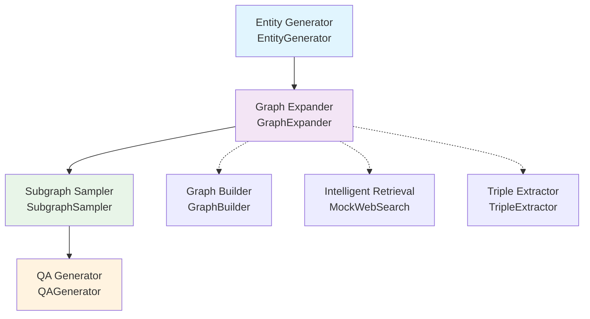

# WebSailor Data Synthesis Module Guide

## 📋 Overview

The WebSailor data synthesis module implements the complete synthesis pipeline for the SailorFog-QA dataset described in the paper, designed to generate Level 3 complex tasks with high uncertainty that are difficult to reduce. This module constructs complex, non-linear knowledge graphs and combines information obfuscation techniques to generate high-difficulty tasks requiring multi-step reasoning and creative exploration.

## 🔄 Data Generation Pipeline



**Core Pipeline:**
1. **Entity Generation** (EntityGenerator) - Generate rare entities using large language models
2. **Graph Expansion** (GraphExpander) - Build complex knowledge graphs from entities
3. **Subgraph Sampling** (SubgraphSampler) - Sample subgraphs with different topological structures
4. **QA Generation** (QAGenerator) - Generate Level 3 complex Q&A pairs based on subgraphs

## 🧩 Core Modules

### 1. EntityGenerator - Entity Generator

Generate rare entities using large language models, replacing traditional Wikidata SPARQL query approaches.

**Configuration Parameters:**
```yaml
entity_generator:
  model_name: "gpt-4o"                    # Large language model name
  api_key: ""                             # API key
  max_tokens: 8124                        # Maximum tokens
  temperature: 0.7                        # Generation temperature
  storage_path: "../data/generated_entities" # Storage path
  min_description_length: 50              # Minimum description length
  min_properties: 3                       # Minimum properties count
```

**Key Features:**
- Batch concurrent entity generation
- Entity validation and deduplication mechanisms
- Support for multiple entity types and domains
- Local caching and persistent storage

**Usage Example:**
```python
from websailor.utils.config import Config
from websailor.data_synthesis.entity_generator import EntityGenerator

config = Config("configs/default_config.yaml")
generator = EntityGenerator(config)

# Generate 200 rare entities
entities = generator.generate_rare_entities(
    num_entities=200,
    batch_size=10
)
```

### 2. GraphExpander - Graph Expander

Iteratively expand knowledge graphs from rare entities to build complex non-linear graph structures.

**Configuration Parameters:**
```yaml
graph_expander:
  max_depth: 5                            # Maximum expansion depth
  max_branches_per_node: 10               # Maximum branches per node
  min_confidence: 0.85                    # Minimum relation confidence
  expansion_probability: 0.5              # Node expansion probability
  max_search_results: 3                   # Maximum search results
  log_path: "../log/graph_expand.log"     # Log file path
```

**Core Algorithms:**
- Probabilistic node selection to avoid linear chain structures
- Iterative depth expansion ensures graph complexity
- Intelligent information retrieval for entity-related information
- Triple extraction to discover relationships between entities

**Usage Example:**
```python
from websailor.data_synthesis.graph_expander import GraphExpander

expander = GraphExpander(config, save_dir="data/expanded_graphs")

# Single entity expansion
graph_path = expander.expand_from_entity_dict(entity_dict)

# Batch expansion
saved_graphs = expander.expand_all_entities("data/generated_entities/entities.json")
```

### 3. MockWebSearch - Intelligent Information Retrieval

Support multiple retrieval modes to provide rich information sources for graph expansion.

**Configuration Parameters:**
```yaml
mock_web_search:
  filter_model: "gpt-4o"                  # Filter model
  wiki_retrieval_url: "http://..."        # Wiki retrieval API URL
  retrieval_method: "llm"                 # Retrieval method (llm/wiki-18)
```

**Retrieval Modes:**

1. **LLM Simulated Retrieval** (`retrieval_method: "llm"`):
   - Uses large language model's internal knowledge to simulate Wikipedia retrieval results
   - Generates relevant information based on the model's training data
   - No external API calls required, faster response time
   - Suitable for testing and development environments

2. **Wiki-18 API Retrieval** (`retrieval_method: "wiki-18"`):
   - Uses external Wiki knowledge base with vector search capabilities
   - Requires the following components:
     - `e5-Flat.index`: Vector index file for fast similarity search
     - `wiki-18.jsonl`: Wikipedia articles dataset in JSONL format
     - `e5-base-v2`: Sentence transformer model for text embedding
   - Provides more accurate and up-to-date information from Wikipedia
   - Requires proper setup of the vector search infrastructure

**Usage Example:**
```python
from websailor.data_synthesis.mock_web_search import MockWebSearch

searcher = MockWebSearch(config)
results = searcher.search_entity_info(
    entity_name="FIFA Women's World Cup",
    entity_type="artifact",
    max_results=3
)
```

### Starting the Vector Retrieval Service

Before using Wiki-18 retrieval, you need to start the vector retrieval service:

```bash
# Navigate to the wiki_18_retrieval directory
cd websailor/utils/wiki_18_retrieval/

# Start the retrieval server
python retrieval_server.py \
    --index_path /path/to/e5_Flat.index \
    --corpus_path /path/to/wiki-18.jsonl \
    --topk 3 \
    --retriever_name e5 \
    --retriever_model intfloat/e5-base-v2 \
    --faiss_gpu
```

**Service Parameters:**
- `--index_path`: Path to the e5-Flat.index file
- `--corpus_path`: Path to the wiki-18.jsonl dataset
- `--topk`: Number of retrieved passages per query (default: 3)
- `--retriever_name`: Name of the retriever model (default: e5)
- `--retriever_model`: Path or name of the sentence transformer model
- `--faiss_gpu`: Enable GPU acceleration for FAISS (optional)

**Service Endpoint:**
- The service will be available at `http://localhost:8000/retrieve`
- Supports batch queries and returns similarity scores
- Default port: 8000 (can be modified in the code)

**Component Requirements for Wiki-18 Retrieval:**
- **e5-Flat.index**: Pre-built vector index file for fast similarity search
- **wiki-18.jsonl**: Wikipedia articles dataset in JSONL format containing article content and metadata
- **e5-base-v2**: Sentence transformer model for converting text queries into vector embeddings

### 4. TripleExtractor - Triple Extractor

Extract knowledge triples from unstructured text using large language models.

**Configuration Parameters:**
```yaml
triplet_extractor:
  model_name: "gpt-4o"                    # Large language model name
  max_tokens: 8124                        # Maximum tokens
  temperature: 0.2                        # Generation temperature
  min_confidence: 0.9                     # Minimum confidence
  max_triples_per_text: 10                # Maximum triples per text
  use_validation: true                    # Enable validation
  filter_generic: true                    # Filter generic relations
```

**Supported Relation Types:**
- `is_a` - Type relations
- `located_in` - Geographic location relations
- `part_of` - Component relations
- `created_by` - Creation relations
- `collaborated_with` - Collaboration relations
- `influenced_by` - Influence relations
- And many other relation types

**Usage Example:**
```python
from websailor.data_synthesis.triplet_extractor import TripleExtractor

extractor = TripleExtractor(config)
triples = extractor.extract_triples(
    text="Relevant text content",
    context_entity="Entity name"
)
```

### 5. GraphBuilder - Graph Builder

Responsible for graph data structure management and basic operations.

**Configuration Parameters:**
```yaml
data_synthesis:
  graph_builder:
    walk_length: 5                        # Random walk length
    num_walks: 100                        # Number of random walks
```

**Key Features:**
- Dynamic management of nodes and edges
- Subgraph extraction and statistical calculations
- Graph serialization and persistence
- NetworkX-based graph operations

### 6. SubgraphSampler - Subgraph Sampler

Sample subgraphs with different topological structures from knowledge graphs.

**Configuration Parameters:**
```yaml
subgraph_sampler:
  min_nodes: 4                            # Minimum number of nodes
  max_nodes: 10                           # Maximum number of nodes
  num_samples: 30                         # Number of samples
  diversity_threshold: 0.1                # Diversity threshold
  log_file: "../log/sample_subgraph.log"  # Log file
  max_attempts_multiplier: 10             # Maximum attempts multiplier
  strategy_weights:                       # Strategy weights
    random: 0.05
    bfs: 0.20
    dfs: 0.20
    community: 0.15
    star: 0.10
    chain: 0.15
    tree: 0.15
  fallback_to_random: true                # Fallback to random sampling
  require_connected: false                # Require connected graphs
```

**Sampling Strategies:**
- **Random**: Randomly select nodes
- **BFS**: Breadth-first search
- **DFS**: Depth-first search
- **Community**: Community detection
- **Star**: Star structure
- **Chain**: Chain structure
- **Tree**: Tree structure

**Usage Example:**
```python
from websailor.data_synthesis.subgraph_sampler import SubgraphSampler

sampler = SubgraphSampler(config)
subgraphs = sampler.sample_subgraphs(
    graph_builder=graph_builder,
    num_samples=30,
    storage_path="data/sampled_subgraphs"
)
```

### 7. QAGenerator - QA Generator

Generate Level 3 high-difficulty Q&A pairs based on subgraphs.

**Configuration Parameters:**
```yaml
qa_generator:
  generate_model: "o3-mini"               # Generation model
  max_tokens: 32768                       # Maximum tokens
  temperature: 1.0                        # Generation temperature
  obfuscation_rate: 0.3                   # Obfuscation rate
  log_file: "../log/qa_generator.log"     # Log file
```

**Level 3 Characteristics:**
- Complex questions requiring multi-step reasoning
- Information synthesis across entity relationships
- High uncertainty that is difficult to reduce
- Detailed search path explanations

**Usage Example:**
```python
from websailor.data_synthesis.qa_generator import QAGenerator

qa_gen = QAGenerator(config)
qa_pairs = qa_gen.generate_qa_pairs(subgraph, num_qa_pairs=3)
```

## 🚀 Quick Start

### 1. Environment Setup

```bash
pip install -r requirements.txt
```

### 2. Configuration

Edit the API keys and related configurations in `configs/default_config.yaml`.

### 3. Complete Pipeline Example

```bash
# 0. Start vector retrieval service (if using Wiki-18 retrieval)
cd websailor/utils/wiki_18_retrieval/
python retrieval_server.py \
    --index_path /path/to/e5_Flat.index \
    --corpus_path /path/to/wiki-18.jsonl \
    --topk 3 \
    --retriever_name e5 \
    --retriever_model intfloat/e5-base-v2 \
    --faiss_gpu

# 1. Generate rare entities
python scripts/generate_entities.py --num_entities 50 --config configs/default_config.yaml

# 2. Expand knowledge graphs
python scripts/expand_graphs.py --entities_file data/generated_entities/entities.json

# 3. Sample subgraphs
python scripts/sample_subgraphs.py --graph_dir data/expanded_graphs

# 4. Generate Q&A pairs
python scripts/generate_sailorfog_qa.py --subgraphs_dir data/sampled_subgraphs
```

### 4. Programmatic Usage

```python
from websailor.utils.config import Config
from websailor.data_synthesis import *

# Load configuration
config = Config("configs/default_config.yaml")

# 1. Generate entities
entity_gen = EntityGenerator(config)
entities = entity_gen.generate_rare_entities(num_entities=10)

# 2. Expand graphs
graph_exp = GraphExpander(config, "data/expanded_graphs")
graphs = [graph_exp.expand_from_entity_dict(e.to_dict()) for e in entities]

# 3. Sample subgraphs and generate Q&A
# ... subsequent steps
```

## ⚙️ Advanced Configuration

### Performance Optimization

**Improve Generation Quality:**
```yaml
triplet_extractor:
  min_confidence: 0.95                    # Increase confidence requirement
  
graph_expander:
  max_branches_per_node: 5                # Reduce branches, improve quality
```

**Improve Generation Speed:**
```yaml
graph_expander:
  expansion_probability: 0.3              # Selective expansion
  max_search_results: 2                   # Reduce retrieval volume

triplet_extractor:
  max_triples_per_text: 5                 # Reduce triple processing volume
```

### Information Retrieval Configuration

**Switch to Wiki-18 API Retrieval:**
```yaml
mock_web_search:
  retrieval_method: "wiki-18"             # Use Wiki API with vector search
  wiki_retrieval_url: "http://localhost:8000/retrieve"  # Vector retrieval service endpoint
```

**LLM Retrieval Optimization:**
```yaml
mock_web_search:
  retrieval_method: "llm"                 # Use LLM internal knowledge
  filter_model: "gpt-4o"                  # High-quality filtering
```

## 🔧 Troubleshooting

### Common Issues

1. **API Call Failures**
   - Check `entity_generator.api_key` configuration
   - Verify network connection and API quotas
   - Confirm correct model names

2. **Vector Retrieval Service Issues**
   - Ensure the retrieval server is running on the correct port
   - Verify paths to `e5-Flat.index` and `wiki-18.jsonl` files
   - Check GPU availability if using `--faiss_gpu` flag
   - Confirm the sentence transformer model is accessible

3. **High Memory Usage**
   - Reduce `graph_expander.max_depth`
   - Lower `subgraph_sampler.num_samples`
   - Decrease batch processing size

4. **Poor Generation Quality**
   - Increase `min_confidence` in various modules
   - Enable `filter_generic` option
   - Adjust generation temperature parameters

### Debug Mode

Enable detailed logging:
```yaml
logging:
  level: "DEBUG"
```

View module logs:
```bash
tail -f log/graph_expand.log
tail -f log/qa_generator.log
tail -f log/sample_subgraph.log
```

## 📊 Output Formats

### Entity File Format
```json
{
  "id": "entity-uuid",
  "label": "Entity name", 
  "description": "Detailed description",
  "entity_type": "Entity type",
  "domain": "Domain",
  "properties": {...},
  "features": {...},
  "relationships": [...]
}
```

### Expanded Graph Format
```json
{
  "seed_entity": {...},
  "nodes": {...},
  "edges": [...],
  "statistics": {...},
  "metadata": {...}
}
```

### Q&A Pair Format
```json
{
  "question": "Complex reasoning question",
  "answer": ["Answer", "Alias"],
  "reasoning": "Reasoning process",
  "reference": {
    "search_path": [...],
    "nodes_used": [...],
    "source_texts_used": [...]
  }
}
```

## 📈 Performance Metrics

- **Entity Generation Success Rate**: Usually >80%
- **Graph Expansion Completion Rate**: Usually >90%
- **Subgraph Connectivity**: Requires 100% connectivity
- **Q&A Generation Quality**: Level 3 complexity guaranteed